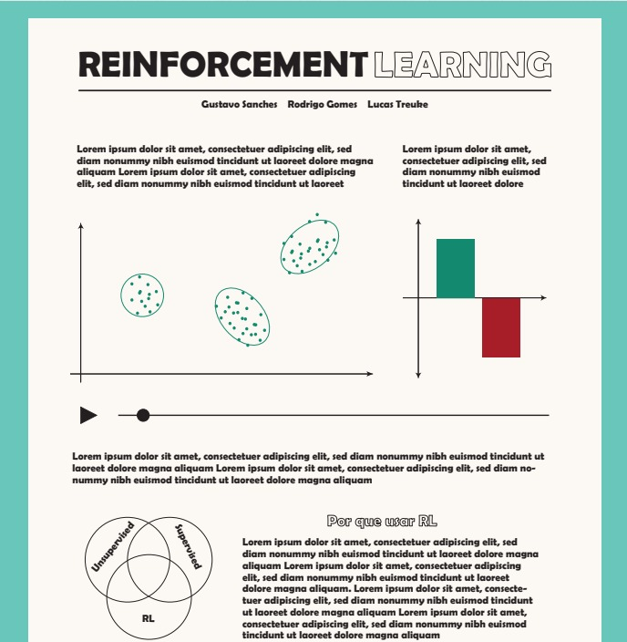
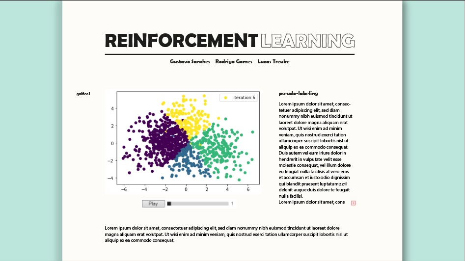
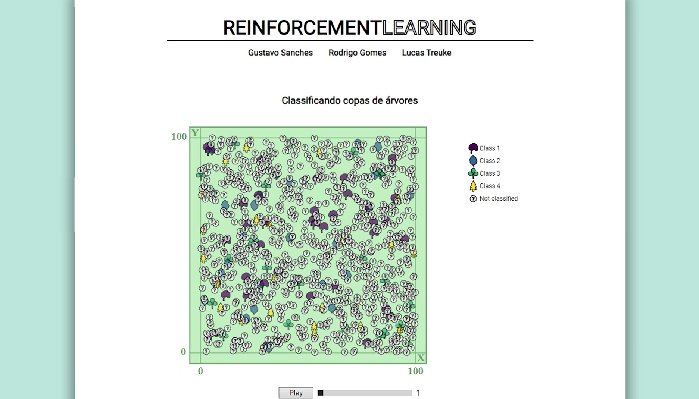
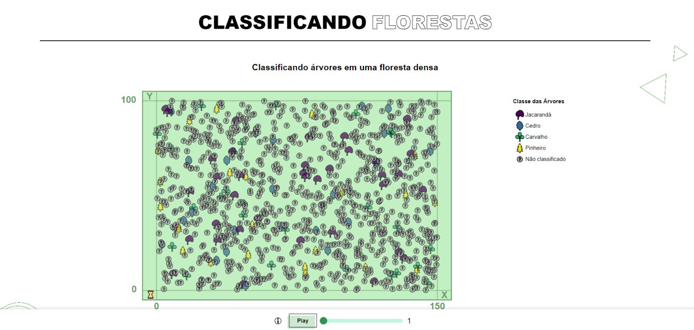

# Visualize & Reinforce
#### Lucas Bryan Treuke, Gustavo Sanches Costa, Rodrigo Gomes Hutz Pintucci
## Descrição

Projeto final da disciplina de Visualização de Dados do curso de Ciência de Dados da *FGV*. O objetivo é propor uma solução criativa para um problema de visualização, usando como base os conceitos e técnicas aprendidos durante o curso e a experiência adquirida com os projetos anteriores, em especial o [Assignment 3 - Charting the World](https://github.com/fgv-vis-2023/assignment-3-chartingtheworld).
Nosso projeto consiste de um trabalho interdisciplinar entre Visualização de Dados e Aprendizado de Máquinas. O resultado final é um site cuja narrativa é guiada por uma visualização interativa, que permite ao usuário explorar os dados e compreender conceitos por trás de duas áreas específicas: *Reinforcement Learning* e *Pseudo-Labeling*.

Utilizamos do *d3.js* para a construção da visualização, sendo importado para um arquivo *HTML* que pode ser acessado através do nosso [site github-pages](https://fgv-vis-2023.github.io/final-project-visualize-reinforce/). Também é possível acessar o *source code* através deste [notebook](https://observablehq.com/d/31ca7950886a92d8).

## Desenvolvimento

### Definindo o tema

Nosso projeto começa em outra disciplina, Aprendizado de Máquinas. Nesta, decidimos explorar uma área não abordada em sala, *Aprendizado por Reforço*. Conversando com professores da área de *Aprendizado de Máquinas* e *Aprendizado Profundo*, chegamos num caso de uso interessante, a classificação de árvores de uma floresta. 

Temos a seguinte situação: imagens são tiradas por cima de uma floresta, e devido à dificuldade de acesso, apenas alguma das árvores são rotuladas. O objetivo é utilizar as imagens rotuladas para classificar as demais. 
Para solucionar isso, primeiro utilizamos de *Pseudo-Rotulagem*, que consiste em utilizar um modelo de classificação para rotular os dados não rotulados, adicionando-os ao conjunto de treinamento. Para isso, parte dos pontos que possui maior confiança.
Como o modelo de classificação utilizado está longe de ser perfeito, buscamos melhorar seu desempenho utilizando de *Aprendizado por Reforço*, que atribui uma recompensa baseada em detalhes de negócio e conhecimento prévio. 

Contudo, o foco deste outro trabalho é a aplicação dos conceitos, que não são tão simples de serem compreendido e deixam a desejar grandes representações visuais dos dados. Dessa forma, decidimos utilizar o projeto final da disciplina de Visualização de Dados para criar uma visualização que sirva como um guia interativo para o entendimento dos conceitos por trás do problema, para o público geral e para nós mesmos.

### Gerando os dados

Como nosso propósito é criar uma visualização que sirva como um guia interativo para o entendimento dos conceitos, precisamos de dados que sejam capazes de representar o problema de forma clara e objetiva. Dessa forma, para termos um maior controle sobre os dados, decidimos utilizar dados sintéticos, ou seja, gerados por nós mesmos.
Temos um total de 1000 pontos, divididas em 4 classes. Cada classe tem duas características, que são geradas aleatoriamente, seguindo uma distribuição normal, sendo que cada classe tem uma média diferente e variância específica. Além disso, todos os pontos possuem coordenadas x e y, que são geradas aleatoriamente, seguindo a mesma distribuição uniforme, de forma que estas coordenadas não possuem relação com as características.
No fim, é criado outro dataset, onde apenas 10% dos pontos estão rotulados, sendo que estes foram escolhidos aleatoriamente. Este dataset possui todas as iterações do *Pseudo-Rotulagem*, de forma que é possível visualizar a evolução da rotulação dos pontos ao longo das iterações. Dessa forma, é possível comparar a rotulação final com os dados originais. 

### Criando protótipos

Uma vez definido o tema, desenvolvemos um protótipo inicial em um *software* de edição de imagens, com o objetivo de visualizar a ideia inicial. O resultado pode ser visto abaixo:

Ainda não havíamos definido quais dados seriam utilizados, mas já tínhamos em mente que seria algo relacionado à classificação de árvores. Assim, nossa ideia era criar um site baseado em outros que apresentam guias interativos de conceitos de *Aprendizado de Máquinas*, como [A Practical Guide to Gaussian Processes](https://infallible-thompson-49de36.netlify.app/) e [Understanding RL Vision](https://distill.pub/2020/understanding-rl-vision/).
Depois de trabalhar um pouco com os dados, refizemos o protótipo, utilizando um dos gráficos que seriam utilizados na visualização final. O resultado pode ser visto abaixo:

#### Storytelling

A partir do segundo protótipo, começamos a pensar na narrativa que seria apresentada. Conversando com professores da área de Visualização, chegamos à conclusão que uma boa abordagem seria a utilização de um gráfico de *Splash*, com o propósito de chamar a atenção do usuário ao entrar no site, mostrando o escopo total do tema sem muita explicação.
Tendo a atenção do usuário, começaríamos a explicar desde o básico o problema e os conceitos por trás dele, utilizando de gráficos interativos para que o usuário possa explorar os dados e compreender melhor o problema. 

Assim, chegamos à construção do site *MVP*, que foi apresentado em sala de aula. O resultado pode ser visto abaixo:

Após a apresentação, recebemos o *feedback* dos colegas, percebemos que muitas coisas ainda poderiam ser melhoradas. Dentre estas, melhoramos a estética dos gráficos e do site, adicionamos mais interatividade e aprimoramos a narrativa.
Em geral, estas foram as sugestões mais importantes que recebemos:

- Utilizar um padrão visual para os gráficos;
    - Para isso, mudamos a paleta de cores de gráficos como a matriz de confusão e amostragens, para que ficassem mais parecidos com os demais;
    - Alteramos tamanho e fonte dos textos.

- Usar de texto de forma mais dinâmica e eficiente;
    - Criamos um fluxograma interativo, onde caixas de texto são adicionadas conforme o usuário faz *hover* em cada etapa;
    - Reordenamos as seções do site, para que o usuário possa ler o texto de forma mais fluida e intuitiva.

- Corrigir gráficos com hovers sem tooltip;
    - Nosso gráfico de dados reais possuía um *hover* que não mostrava nenhuma informação, o que foi corrigido.

- Transformar o título do splash em uma pergunta, com subtítulo para informações;
    - Alteramos o título para "Como classificar árvores eficientemente?", com o subtítulo "Classificação de árvores dadas poucas amostras rotuladas".

- Informações para o slider;
    - Adicionamos indicações de onde o usuário pode utilizar o slider;
    - O slider agora indica que os valores são referentes à iteração.

- Adicionar legenda para gráficos de amostragem;
    - Adicionamos uma legenda para o gráfico de mistura de normais, para que o usuário entenda o que cada linha representa;
    - Adicionamos informação de média e variância em ambos os gráficos de amostragem.

- Aprimoramento geral do texto;
    - Completamos o texto do site para seções onde se utilizavam *lorem ipsum*;
    - Correção de typos e padronização de termos.

- Redimensionar splash e adicionar filtros para reduzir overplotting;
    - O gráfico de splash, antes quadrado, foi redimensionado para um retângulo, para que o usuário possa ver melhor os pontos;
    - Adicionamos filtros para que o usuário possa ver melhor as classes desejadas.

Algumas sugestões foram deixadas de lado, pois não se encaixavam na narrativa que queríamos apresentar. Dentre estas, podemos citar:

- Reduzir número de tooltips;
    - Como queríamos que o usuário pudesse explorar os dados, não achamos que seria uma boa ideia remover os tooltips, pois eles são uma forma de apresentar informações de pontos específicos.

- Substituir nome das *features* por exemplos temáticos de árvore;
    - Gostaríamos de deixar as características mais genéricas, para que o usuário possa entender que quaisquer características podem ser utilizadas para classificar árvores;
    - Contudo, para padronizar o texto, trocaríamos o nome das *features* por "característica 1" e "característica 2".

O resultado final pode ser visto abaixo:

### Equipe e divisão de tarefas

Como em nosso último trabalho, nossa equipe é composta por três integrantes que foram responsáveis por todo o processo de desenvolvimento da visualização, desde a escolha do tema até a implementação final. Assim, toda decisão recebeu *input* de todos os membros, que participaram de todas as etapas do projeto.
Abaixo segue os integrantes e algumas áreas de maior foco, para que várias tarefas pudessem ser realizadas simultaneamente:

- **Lucas Bryan Treuke**: Construção do [site](https://fgv-vis-2023.github.io/final-project-visualize-reinforce/), interatividade dos gráficos;
- **Gustavo Sanches Costa**: Criação dos dados, protótipos e [artigo](https://google.com);
- **Rodrigo Gomes Hutz Pintucci**: [Página sobre do projeto](https://fgv-vis-2023.github.io/final-project-visualize-reinforce/about), estética dos gráficos, relatório.

Vale ressaltar que a participação dos membros não se limitou às áreas de maior foco mencionadas.

### Overview

A implementação do projeto foi feita em *d3.js*, como mencionado anteriormente. Para a versão final, temos um único *slider*, que funciona universalmente para todos os gráficos que dependem de iteração, uma vez que estes estão conectados:
- **Slider universal**: O *slider* é utilizado para selecionar a iteração do *Pseudo-Rotulagem* que será exibida, podendo ser alterada manualmente pelo usuário.
    - **Animação**: O usuário pode também selecionar a opção de animação, através de um botão de *play*, que fará com que o ano seja atualizado automaticamente. 

A seguir, temos uma breve descrição de cada gráfico e suas funções de interatividade.

#### Splash
Temos como gráfico principal um *scatterplot*, cuja aparência é de modo a simular uma floresta. Cada ponto representa uma árvore, sendo que a forma e a cor do ponto representam a classe da árvore. Suas funções de interatividade são:

- **Slider universal**;
- **Legenda interativa**: O usuário pode desselecionar e selecionar as classes que deseja visualizar, clicando em sua respectiva legenda. 
    - Inicialmente, todas as classes estão selecionadas. Clicar em uma classe desativada a ativa, e vice-versa.
    - Uma classe desativada não é exibida no gráfico.
    - **Hover**: Realizar *hover* sobre a legenda faz com que a respectiva classe seja destacada no gráfico.
- **Hover**: Realizar *hover* sobre um ponto faz com que ele seja destacado, e suas informações são exibidas em um *tooltip*.
    - A cor do ponto é alterada para vermelho durante a interação, retornando à cor original ao finalizar.
    - O *tooltip* retorna a classe atribuída ao ponto, as duas características de interesse do projeto e as coordenadas *x* e *y* do ponto.

#### Fluxograma interativo
O fluxograma interativo é uma representação visual do algoritmo de *Pseudo-Rotulagem* com *Apredizado por Reforço*. Ele possui várias seções, que são adicionadas conforme o usuário faz *hover* em cada etapa.
 Suas funções de interatividade são:
- **Hover**: ao realizar *hover* sobre uma etapa, uma caixa de texto é adicionada à seção de texto, explicando a etapa em questão.
    - A caixa de texto é removida ao finalizar a interação.
    - A seção do fluxograma que representa a etapa em questão é destacada, enquanto as outras seções são escurecidas. Ao finalizar a interação, todas as seções retornam ao normal.

#### Pseudo-Rotulagem
O gráfico de *Pseudo-Rotulagem* é um *scatterplot* que representa a classificação de árvores ao longo das iterações do algoritmo. Agora, o gráfico se encontra em um plano cartesiano no espaço de características. Suas funções de interatividade são:

- **Slider universal**;
- **Hover**: Realizar *hover* sobre um ponto faz com que ele seja destacado, e suas informações são exibidas em um *tooltip*.
    - A cor do ponto é alterada para vermelho durante a interação, retornando à cor original ao finalizar.
    - O *tooltip* retorna a classe atribuída ao ponto e as duas características de interesse do ponto.

#### Dados reais
Gráfico de *scatterplot*, que serve para comparar o resultado do algoritmo visto no gráfico anterior com os dados reais. Suas funções de interatividade são:

- **Hover**: Realizar *hover* sobre um ponto faz com que ele seja destacado, e suas informações são exibidas em um *tooltip*.
    - A cor do ponto é alterada para vermelho durante a interação, retornando à cor original ao finalizar.
    - O *tooltip* retorna a classe atribuída ao ponto e as duas características de interesse do ponto.

#### Matriz de confusão
Gráfico de matriz de confusão, que serve para mostrar o número de acertos e erros em cada iteração do algoritmo. Suas funções de interatividade são:

- **Slider universal**;

#### Amostragem

Gráfico de *scatterplot* com objetivo didático de demonstrar o resultado da amostragem de dados num plano 2D, onde cada eixo possui uma distribuição normal. Suas funções de interatividade são:

- **Hover**: Realizar *hover* sobre um ponto faz com que ele seja destacado, e suas informações são exibidas em um *tooltip*.
    - A cor do ponto é alterada para vermelho durante a interação, retornando à cor original ao finalizar.
    - O *tooltip* retorna as coordenadas *x* e *y* do ponto.
- **Distribuições interativas**: Acima e à direita do gráfico, se encontram duas normais, que representam as distribuições de cada eixo. O usuário pode alterar os parâmetros destas distribuições, através de círculos que se encontram na ponta dessas normais.
    - Deslizar o círculo sobre a direção do eixo altera o parâmetro *média* da distribuição.
    - Deslizar o círculo sobre a direção perpendicular ao eixo altera o parâmetro *variância* da distribuição.
- **Botão**: O usuário pode clicar no botão *Mudar amostra* para gerar uma nova amostra de dados, com base nas mesmas distribuições.

#### Mistura de normais

Plano cartesiano com objetivo didático de demonstrar o resultado da mistura de normais, onde duas distribuições normais se encontram, onde o eixo *x* representa os valores e o eixo *y* a densidade de probabilidade. Além disso, é desenhada uma outra curva que representa a mistura dessas normais.
Suas funções de interatividade são:
- **Distribuições interativas**: Acima e à direita do gráfico, se encontram duas normais, que representam as distribuições de cada eixo. O usuário pode alterar os parâmetros destas distribuições, através de círculos que se encontram na ponta dessas normais.
    - Deslizar o círculo sobre a direção do eixo altera o parâmetro *média* da distribuição.
    - Deslizar o círculo sobre a direção perpendicular ao eixo altera o parâmetro *variância* da distribuição.
- **Slider de peso**: O usuário pode alterar o peso da distribuição inicialmente à esquerda, através de um *slider*.
    - O valor varia entre 0 e 1, sendo que a soma dos pesos das duas distribuições deve ser igual a 1.
        - Caso o valor escolhido seja 0, a mistura de normais equivale à distribuição inicialmente à direita. 
        - Analogamente, caso o valor escolhido seja 1, a mistura de normais equivale à distribuição inicialmente à esquerda.
        - Para valores intermediários, a mistura de normais é uma combinação das duas distribuições.